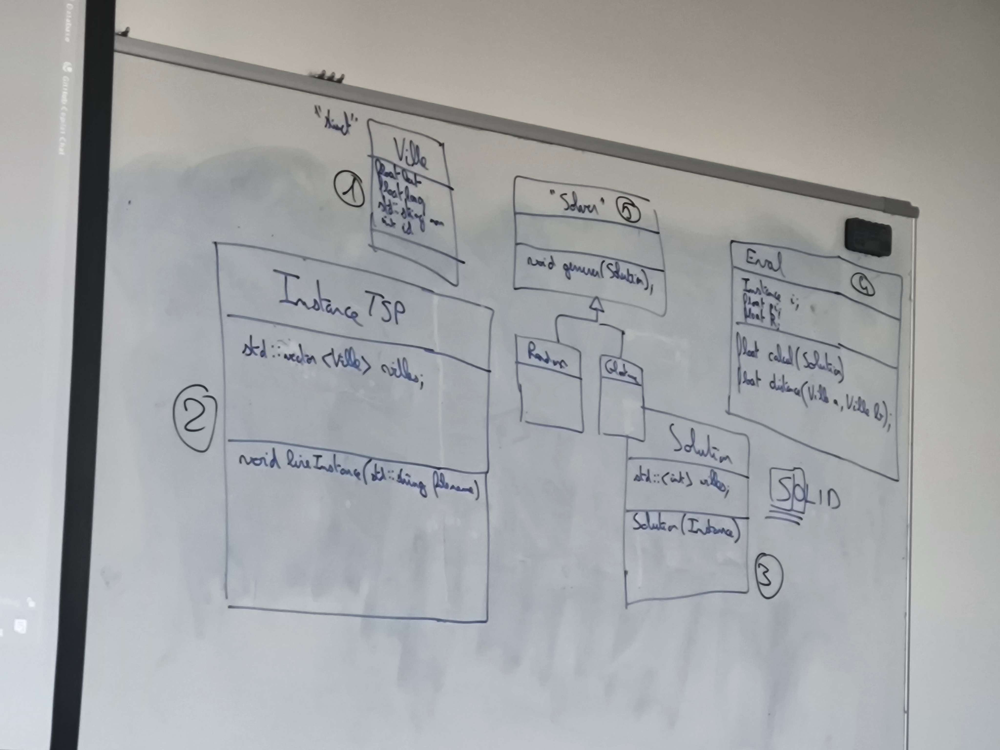
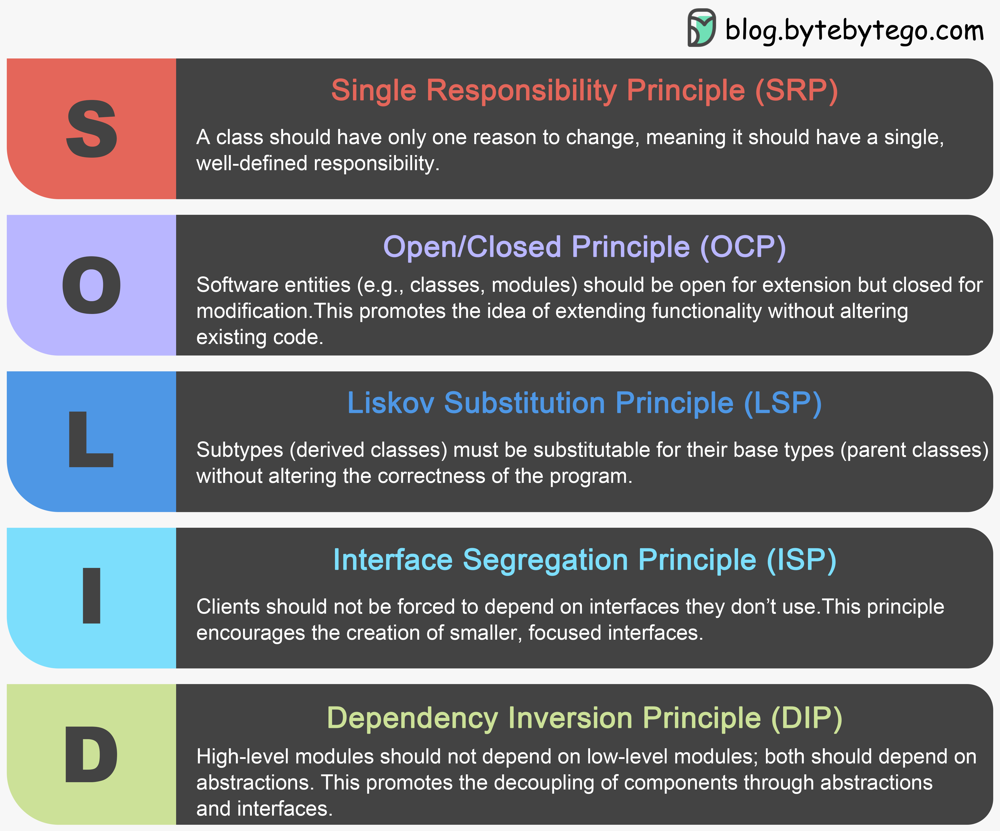

# projectTSP_GaruXer-Setsuma

## Faire diagramme de classe
* [X] Faire diagramme de classe
* [X] Ville en structure (pas une classe) (STEP 1)
* [X] Instance qui prend en paramètre un fichier de villes et qui le lit (STEP 2)
  * [X] Toutes les données du problème, chargement des villes et des distances
* [X] Classe Solution (STEP 3)
  * [X] Instance Solution
* [X] Classe Eval (qui calcul une solution) (STEP 4)
  * [X] Dans cette class, les constantes du rayon, de PI et la fonction qui calcul la distance entre 2 villes
* [X] Classe abstraite (STEP 5)
  * [X] Méthode virtuelle qui renvoie une solution par rapport à des données d'entrée 
* [X] Classe Glouton (Greedy in English) implémente la classe abstraite (STEP 5b)
  * [X] Méthode qui prend une ville de départ et qui renvoie une solution 
* [X] Classe Random implémente la classe abstraite (STEP 5c)
  * [X] Méthode qui renvoie une solution aléatoire en prenant en compte les villes

Diagramme de classe : 

SOLID : 
* Single Responsibility :warning:
  * Une classe = une responsabilité 
* Open/Closed :warning:
  * On peut ajouter des classes, mais pas modifier les classes existantes
* Liskov Substitution
* Interface Segregation
* Dependency Inversion
