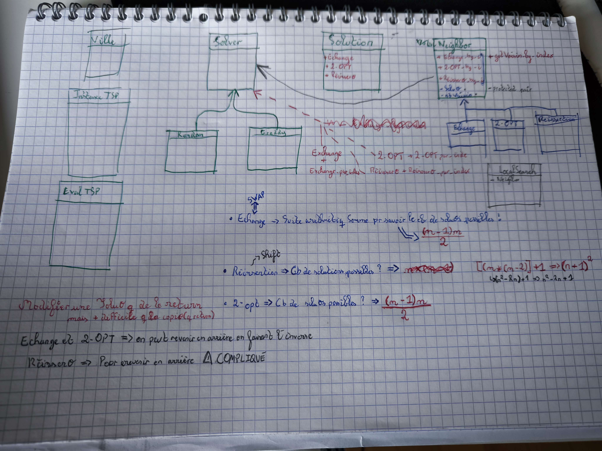

# projectTSP_GaruXer-Setsuma
## MASTER 1 CYBER - Simon Deweerdt & Thomas Siest

## Table des matières
1. [Introduction](#introduction)
2. [Structure du projet](#structure-du-projet)
3. [Classes et fichiers](#classes-et-fichiers)
4. [Diagramme de classe v1](#diagramme-de-classe-v1)
5. [Diagramme de classe v2](#diagramme-de-classe-v2)
6. [Principes SOLID](#principes-solid)

## Introduction
Ce projet a pour but de résoudre le problème du voyageur de commerce (TSP) en utilisant différentes approches.
Le TSP est un problème d'optimisation combinatoire qui consiste à trouver le plus court chemin pour visiter toutes les villes d'un ensemble donné.

## Structure du projet
Le projet est structuré comme suit :
- `src/` : Contient tous les fichiers source du projet.
  - `EvalTSP.cpp`
  - `EvalTSP.h`
  - `Greedy.cpp`
  - `Greedy.h`
  - `InstanceTSP.cpp`
  - `InstanceTSP.h`
  - `LocalSearch.cpp`
  - `LocalSearch.h`
  - `Neighbor.cpp`
  - `Neighbor.h`
  - `Random.cpp`
  - `Random.h`
  - `RandomGenerator.cpp`
  - `RandomGenerator.h`
  - `Reinsertion.cpp`
  - `Reinsertion.h`
  - `Search.cpp`
  - `Search.h`
  - `Solution.cpp`
  - `Solution.h`
  - `Solver.h`
  - `Swap.cpp`
  - `Swap.h`
  - `TwoOpt.cpp`
  - `TwoOpt.h`
- `README.md` : Ce fichier.
- `CMakeLists.txt` : Fichier de configuration de CMake.

## Classes et fichiers

| Classe / Fichier                             | Description                                                                                                                                                                    |
|----------------------------------------------|--------------------------------------------------------------------------------------------------------------------------------------------------------------------------------|
| `EvalTSP.cpp` et `EvalTSP.h`                 | Ces fichiers définissent la classe `EvalTSP` qui est utilisée pour évaluer une solution du problème du voyageur de commerce.                                                   |
| `Greedy.cpp` et `Greedy.h`                   | Ces fichiers définissent la classe `Greedy` qui implémente une méthode gloutonne pour résoudre le problème du voyageur de commerce.                                            |
| `InstanceTSP.cpp` et `InstanceTSP.h`         | Ces fichiers définissent la classe `InstanceTSP` qui représente une instance du problème du voyageur de commerce.                                                              |
| `LocalSearch.cpp` et `LocalSearch.h`         | Ces fichiers définissent la classe `LocalSearch` qui implémente une recherche locale pour améliorer une solution du problème du voyageur de commerce.                          |
| `Neighbor.cpp` et `Neighbor.h`               | Ces fichiers définissent la classe `Neighbor` qui est utilisée pour générer les voisins d'une solution du problème du voyageur de commerce.                                    |
| `Random.cpp` et `Random.h`                   | Ces fichiers définissent la classe `Random` qui est utilisée pour générer des solutions aléatoires du problème du voyageur de commerce.                                        |
| `RandomGenerator.cpp` et `RandomGenerator.h` | Ces fichiers définissent la classe `RandomGenerator` qui est utilisée pour générer des nombres aléatoires.                                                                     |
| `Reinsertion.cpp` et `Reinsertion.h`         | Ces fichiers définissent la classe `Reinsertion` qui est utilisée pour modifier une solution du problème du voyageur de commerce en réinsérant une ville à une autre position. |
| `Search.cpp` et `Search.h`                   | Ces fichiers définissent la classe `Search` qui est une classe abstraite pour les méthodes de recherche.                                                                       |
| `Solution.cpp` et `Solution.h`               | Ces fichiers définissent la classe `Solution` qui représente une solution du problème du voyageur de commerce.                                                                 |
| `Solver.h`                                   | Ce fichier définit la classe `Solver` qui est une classe abstraite pour les solveurs du problème du voyageur de commerce.                                                      |
| `Swap.cpp` et `Swap.h`                       | Ces fichiers définissent la classe `Swap` qui est utilisée pour modifier une solution du problème du voyageur de commerce en échangeant deux villes.                           |
| `TwoOpt.cpp` et `TwoOpt.h`                   | Ces fichiers définissent la classe `TwoOpt` qui implémente l'algorithme 2-opt pour améliorer une solution du problème du voyageur de commerce.                                 |

## Diagramme de classe v1

### Premières étapes
* [X] Faire diagramme de classe
* [X] Ville en structure (pas une classe) (STEP 1)
* [X] Instance qui prend en paramètre un fichier de villes et qui le lit (STEP 2)
  * [X] Toutes les données du problème, chargement des villes et des distances
* [X] Classe Solution (STEP 3)
  * [X] Instance Solution
* [X] Classe Eval (qui calcul une solution) (STEP 4)
  * [X] Dans cette class, les constantes du rayon, de PI et la fonction qui calcul la distance entre 2 villes
* [X] Classe abstraite (STEP 5)
  * [X] Méthode virtuelle qui renvoie une solution par rapport à des données d'entrée 
* [X] Classe Glouton (Greedy in English) implémente la classe abstraite (STEP 5b)
  * [X] Méthode qui prend une ville de départ et qui renvoie une solution 
* [X] Classe Random implémente la classe abstraite (STEP 5c)
  * [X] Méthode qui renvoie une solution aléatoire en prenant en compte les villes

## Diagramme de classe v2

### Deuxièmes étapes
* [X] Classe abstraite (STEP 6)
  * [X] Méthode virtuelle qui renvoie une solution par rapport à des données d'entrée
* [X] Classe LocalSearch implémente la classe abstraite (STEP 6b)
  * [X] Méthode qui prend une solution et qui renvoie une solution améliorée
* [X] Classe Neighbor (STEP 7)
  * [X] Méthode qui prend une solution et qui renvoie une solution voisine
* [X] Classe Swap (STEP 7b)
  * [X] Méthode qui prend une solution et qui renvoie une solution en échangeant 2 villes
* [X] Classe TwoOpt (STEP 7c)
  * [X] Méthode qui prend une solution et qui renvoie une solution en échangeant 2 villes
* [X] Classe Reinsertion (STEP 7d)
  * [X] Méthode qui prend une solution et qui renvoie une solution en réinsérant une ville à une autre position
* [X] Classe Search (STEP 8)
  * [X] Méthode qui prend une solution et qui renvoie une solution améliorée
* [X] Classe Solver (STEP 9)
  * [X] Méthode qui prend une instance et qui renvoie une solution
* [X] Classe RandomGenerator (STEP 10)
  * [X] Méthode qui renvoie un nombre aléatoire

## Principes SOLID
* Single Responsibility :warning:
  * Utilisé dans le projet
  * Une classe = une responsabilité
* Open/Closed :warning:
  * Utilisé dans le projet
  * On peut ajouter des classes, mais pas modifier les classes existantes
* Liskov Substitution
* Interface Segregation
* Dependency Inversion
  